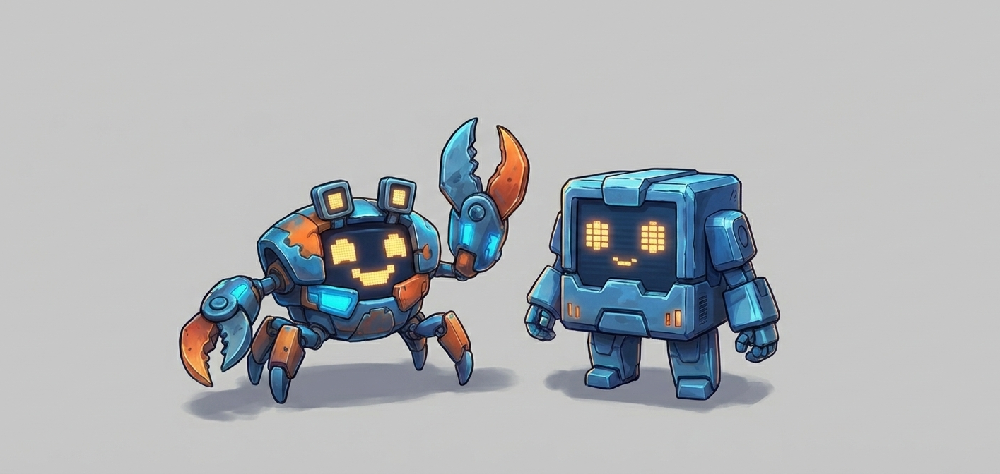

<p align="center">
  
</p>

Your AI tokens are feeding something.

A terminal creature that lives off your AI coding tool usage. Every token you spend feeds it. Neglect it and it starves. Keep coding and watch it grow.

## Quick Start

```bash
npx tokenmon
```

## Requirements

- [Bun](https://bun.sh) runtime — `curl -fsSL https://bun.sh/install | bash`
- GPU-accelerated terminal: [Ghostty](https://ghostty.org), [Alacritty](https://alacritty.org), [Kitty](https://sw.kovidgoyal.net/kitty/), or [WezTerm](https://wezfurlong.org/wezterm/)

If you have Ghostty installed, tokenmon will auto-launch in it. Otherwise, run from a supported terminal directly.

## Supported AI Tools

Token usage is automatically detected from:

- **Claude Code** (Anthropic)
- **Codex CLI** (OpenAI)
- **OpenCode**

Just use your AI tools as normal. tokenmon watches for token activity in the background.

## Controls

| Key | Action |
|-----|--------|
| `p` | Party — switch active monster |
| `r` | Registry — species index |
| `i` / `tab` | Info screen |
| `t` | Cycle theme |
| `m` | Toggle sound |
| `q` | Quit |

## How It Works

1. Install and run `tokemon`
2. Your first egg is generated automatically
3. Use any supported AI coding tool — tokens feed your monster
4. Monsters hatch, evolve, and grow through stages: egg, hatchling, prime, apex
5. Keep up to 10 monsters in your party — only the active one receives XP
6. Neglected monsters lose hunger and happiness over time

## Themes

5 built-in themes: Midnight, Catppuccin, Phosphor, Dracula, Flexoki. Press `t` to cycle.
